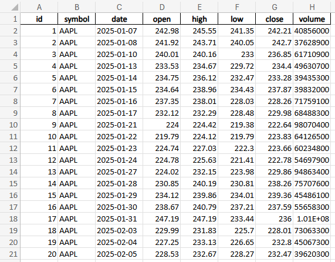

# Stock data to Excel and SQL Database.

## 1. What does this project do?
This project fetches the last 20 days of a stocks trading data from Yahoo Finance, stores it in an SQLite database, and exports it to an Excel file for easy analysis.

Example of Excel output : 

## 2. How do I use it?
Simply run the script and it will prompt you to enter your desired ticker. (e.g. Enter `AAPL` to retrieve Apple's stock data.)

It will then give you a SQL Database and Excel populated with 20 days of trading data on the stock of your choosing.

## 3. Where does the database and Excel file get saved?
Both files are saved in the same directory as the script.
